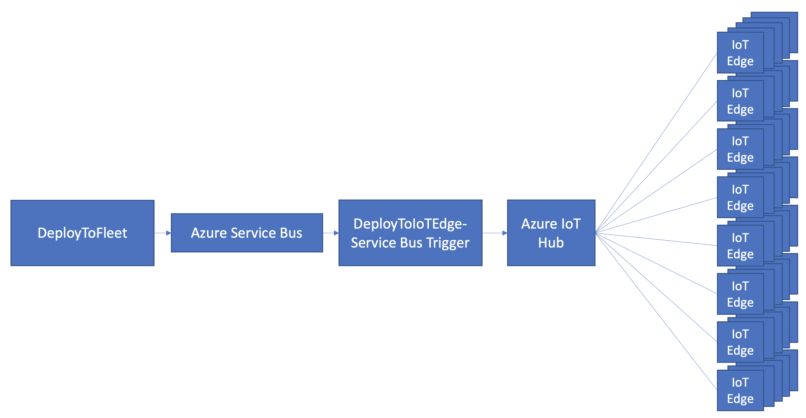

readme.md
# IoT Edge Configuration Management

This project provides an approach to configure workloads on a fleet of IoT Edge. A workload is one or more Docker containers running as IoT Edge Modules.

The goal is to provide both guidance as well as a sample implementation to enable Workloads that run on IoT Edge.

<br>

## Table of contents
* [Engage and contribute](#engage-and-contribute)
* [Solution goals](#solution-goals)
* [Solution architecture & components](#solution-architecture-&-components)
* [PowerApps sample](#powerapps-sample)

<br>

## Engage and contribute
* Ask questions about developing for Azure IoT Edge on [Stack Overflow](https://stackoverflow.com/questions/tagged/azure-iot-edge) using the **azure-iot-edge** tag.

* Search for [known issues](https://github.com/AzureIoTGBB/iot-edge-configuration-manager/issues) or file a [new issue](https://github.com/AzureIoTGBB/iot-edge-configuration-manager/issues/new) if you find something broken in this project.

* Learn how you can contribute to this project [here](./documentation/contributing.md).

* This project has adopted the [Microsoft Open Source Code of Conduct](https://opensource.microsoft.com/codeofconduct/).
For more information, see the [Code of Conduct FAQ](https://opensource.microsoft.com/codeofconduct/faq/) or contact [opencode@microsoft.com](mailto:opencode@microsoft.com) with any additional questions or comments.

<br>
<br>

## Solution goals

The idea for this solution stems from a customer need to deploy varying workloads to a fleet of IoT Edge at various locations (retail stores/factories/oil wells/etc.). Each IoT Edge has specific workloads it runs and is specific to the location.

For example, consider a retail store with multiple IoT devices such as Chillers, Refrigerators, HVAC, Cameras, Safe and other devices. All of these devices are connected to IoT Edge. Each of these IoT devices has one or more modules in IoT Edge with location specific configurations such as IP address of the device, environment variables and desired properties. 

As the number of locations increases and the variability in number of devices per location, such as numebr of camera, configuration for each camera (IP address, camera type, etc.), the management and deployment of the workloads will tend to get complex and does not readily fit into IoT edge [Automatic Deployment for single devices or at scale](https://docs.microsoft.com/en-us/azure/iot-edge/module-deployment-monitoring). Considering each IoT Edge is different and has variability in configurations by workload, a single deployment manifest for the entire fleet will not meet the needs of all Edges. 

This solution demonstrates the ability to generate heterogeneous edge workloads for needs of the kind illustrated in the following picture: 
As described in the picture above, while the 4 Edge are connected to the same IoT hub, each Edge has varying workloads and location specific information. 
<br>
<br>
<br>

## Solution architecture & components

 
The solution is implemented as a REST API that accepts a JSON document that defines the modules, desired properties and routes [MDR] for each of the modules that constitutes the workload. The REST API is implemented in Azure Functions and it uses [Azure IoT Hub Service .NET SDK](https://github.com/Azure/azure-iot-sdk-csharp) to interact with Azure IoT Hub for deployment to IoT Edge. [CosmosDB](https://docs.microsoft.com/en-us/azure/cosmos-db/introduction) is used as the data store for Edge Manifest & Module definition.


## Solution architecture

The solution consists of the following components:

1. CosmosDB Database with 2 collections\containers
  - manifest - a single document that defines the template for IoT Edge Manifest. The [manifest](./restapi/manifest.json) is a template with definitions for edgeAgent and edgeHub, and the rest of the manifest is not populated. In this example there is only a single manifest temeplate file, however the solution can be extended to support multiple manifest templates versions depending on the need.

  - allmodules - a list of modules that are available for deployment as a workload. The [module definition](./module.json) includes the version of docker container and container create options. This can be further extended to support instance specific container create options.

2. A single Azure Functions Project with an HttpTrigger Function developed using .NET


## Understanding the Solution
At the core, an IoT Edge Deployment Manifest consists of the following sections
1. Modules
2. Desired Properties
3. Routes
This solution assembles these sections to generate an IoT Edge Manifest specific to the workload.

Here is a example walk-thru of a solution.

Scenario:
Consider a retail location with 
1. A chiller accessible over IP @ 10.3.4.5
2. A freezer accessible over IP @ 10.3.4.6
3. A temp analyzer that reacts to temp readings from Chiller, Freezer


The workload comprises of the following 3 IoT Edge Modules (docker containers) namely:
1. Chiller (acrcontainers.azurecr.io/chiller:v1)
2. Freezer (acrcontainers.azurecr.io/freezer:v2)
3. Temp Analyzer (acrcontainers.azurecr.io/tempanalyzer:v1)

Each of these modules has a set of Desired Properties and Routes that define the workload configuration on IoTEdge.

The input to REST API to generate IoT Edge manifest will be as follows:

```json
[
  {
    "ModuleInstanceName": "BackroomChiller",
    "Module": "chiller",
    "DesiredProperties": "{\"endPoint\": \"10.3.4.5\",\"armEndpoint\": \"https://chiller.azurewebsites.net/\",\"diagnosticsEventsOutputName\": \"chillerDiagnostics\",\"operationalEventsOutputName\": \"chillerOperational\",\"logLevel\": \"Information\",\"logCategories\": \"Application,Events\",\"telemetryOptOut\": false}",
    "Routes": [
      {
        "RouteInstanceName": "BackroomChillerToTempAnalyzer",
        "FromModule": "BackroomChiller",
        "FromChannel": "tempreadings",
        "ToModule": "TempAnalyzer",
        "ToChannel": "chillertemp",
        "ToIoThub": false
      },
      {
        "RouteInstanceName": "BackroomChillerToIoTHub",
        "FromModule": "BackroomChiller",
        "FromChannel": "tempdiagnostics",
        "ToModule": "",
        "ToChannel": "",
        "ToIoThub": true
      }
    ]
  },
  {
    "ModuleInstanceName": "frontfreezer",
    "Module": "freezer",
    "DesiredProperties": "{\"endPoint\":\"10.3.4.6\"}",
    "Routes": [
      {
        "RouteInstanceName": "frontfreezerToTempAnalyzer",
        "FromModule": "frontfreezer",
        "FromChannel": "tempreadings",
        "ToModule": "TempAnalyzer",
        "ToChannel": "freezertemp",
        "ToIoThub": false
      }
    ]
  },
  {
    "ModuleInstanceName": "tempAnalyzer",
    "Module": "tempAnalyzer",
    "DesiredProperties": "{\"chillerThreshold\":\"43\", \"freezerThreshold\":\"32\"}",
    "Routes": [
      {
        "RouteInstanceName": "tempAnalyzerToIoTHub",
        "FromModule": "tempanalyzer",
        "FromChannel": "*",
        "ToModule": "",
        "ToChannel": "",
        "ToIoThub": true
      }
    ]
  }
]
```
As you can see in this workload definition, there is workload specific configuration applied as desired properties. Imagine having a core configuration management database across the organization that houses all the location specific information that can be applied at the time of IoT Edge manifest generation, thereby supporting the need for location specific configurations in IoT Edge Manifest.

The REST API depends on a base manifest template and module definition to be stored in CosmosDB to generate the final IoT Edge manifest.


### Manifest Template
The manifest template is a placeholder that defines the structure of IoT Edge manifest and is already populated with edgeAgent and edgeHub information. A sample of the manifest is as defined [here](./restapi/manifest.json). 


### Modules Definition
Modules define the docker container and its create options. Building on the example here is a definition for Chiller module :
```json
{
    "chiller": {
        "version": "1.0",
        "type": "docker",
        "status": "running",
        "restartPolicy": "always",
        "settings": {
            "image": "yourcontainerregistry.azurecr.io/chiller:1",
            "createOptions": "{\"HostConfig\":{\"LogConfig\":{\"Type\":\"\",\"Config\":{\"max-size\":\"10m\",\"max-file\":\"10\"}},\"Binds\":[\"/Users/jaypaddy/chiller/output:/var/output/\",\"/Users/jaypaddy/chiller/input:/var/input/\"]}}"
        }
    }
}
```
In CosmosDB a list of these module definitions are stored as JSON documents that can be queried based on name, in this case, "chilleer". Imagine a list of modules across the Enterprise stored in CosmosDB as the library of modules from which an operator can choose to deploy the various modules required for the workload. 
While in this case the module definitions are static, one can implement a task as part of the CI/CD process for IoT Edge modules to update the CosmosDB document with the latest version of the docker container for each of the modules, thereby when the next time IoT edge deployment happens, the latest version of the docker containers is applied.

The REST API is currently implemented as a HTTP Trigger, however it can be updated to support Azure Service Bus as the input trigger for fleet deployment.


## Deploying the Solution
* CosmosDB
  - Create a CosmosDB Account
  - Create a CosmosDB Database
  - Create a CosmosDB collection named "manifest" with partitionkey : /version
  - Create a CosmosDB collection named "allmodules" with partitionkey : /moduleid 
  - Add an item to "manifest" collection in CosmosDB with 2 elements "version" and "modulesContent" 
  ```json
      "version": "1.0",
      "modulesContent": {
          "$edgeAgent": {
              "properties.desired": {
                  "schemaVersion": "1.0",
                  "runtime": {
                      "type": "docker",
                      "settings": {
                          "minDockerVersion": "v1.25",
                          "loggingOptions": "",
                          "registryCredentials": {
                              "default": {
                                  "username": "{$ACRUSER}",
                                  "password": "{$ACRPASSWORD}",
                                  "address": "{$ACR}"
                              }
                          }
                      }
                  },
                  "systemModules": {
                      "edgeAgent": {
                          "type": "docker",
                          "settings": {
                              "image": "mcr.microsoft.com/azureiotedge-agent:1.0.10",
                              "createOptions": "{}"
                          }
                      },
                      "edgeHub": {
                          "type": "docker",
                          "status": "running",
                          "restartPolicy": "always",
                          "settings": {
                              "image": "mcr.microsoft.com/azureiotedge-hub:1.0.10",
                              "createOptions": "{\"HostConfig\":{\"PortBindings\":{\"5671/tcp\":[{\"HostPort\":\"5671\"}],\"8883/tcp\":[{\"HostPort\":\"8883\"}],\"443/tcp\":[{\"HostPort\":\"443\"}]}}}"
                          }
                      }
                  },
                  "modules": {}
              }
          },
          "$edgeHub": {
              "properties.desired": {
                  "schemaVersion": "1.0",
                  "routes": {},
                  "storeAndForwardConfiguration": {
                      "timeToLiveSecs": 7200
                  }
              }
          }
      }
  ```
  - Add items to "allmodules" collection in CosmosDB with 2 elements "moduleid" and definition of the module
  ```json
      "moduleid": "lvaEdge",
      "lvaEdge": {
          "version": "1.0",
          "type": "docker",
          "status": "running",
          "restartPolicy": "always",
          "settings": {
              "image": "mcr.microsoft.com/media/live-video-analytics:1",
              "createOptions": "{\"HostConfig\":{\"LogConfig\":{\"Type\":\"\",\"Config\":{\"max-size\":\"10m\",\"max-file\":\"10\"}},\"Binds\":[\"/Users/jaypaddy/lva/lvaadmin/samples/output:/var/media/\",\"/Users/jaypaddy/lva/local/mediaservices:/var/lib/azuremediaservices/\"]}}"
          }
      }
  ``` 

* Azure Function
  - Create a Resource Group
  - Deploy Azure Function DeployToIoTEdge 
  - Update Application Settings with appropriate environment variables as defined in local.settings.json
    - "AzureWebJobsStorage": "<CONNECTION STRING>"
    - "IOTHUB_CONN_STRING_CSHARP": "<IOT HUB SERVICE CONNECTIONSTRING>"
    - "ACRUSER": "<AZURE CONTAINER REGISTRY USER NAME>"
    - "ACRPASSWORD": "<AZURE CONTAINER REGISTRY PASSWORD>"
    - "ACR": "<AZURE CONTAINER REGISTRY SERVER>"
    - "COSMOSENDPOINT": "<COSMOSDB ACCOUNT URI>"
    - "COSMOSKEY": "<COSMOSDB ACCOUNT KEY>"
    - "COSMOSDATABASEID": "<COSMOSDB DATABASE NAME>"
    - "COSMOSCONTAINER_ALLMODULES": "<COSMOSDB ALLMODULES COLLECTION NAME>"
    - "COSMOSCONTAINER_MANIFEST": "<COSMOSDB MANIFEST COLLECTION NAME>"


* Sample Request to Azure Function HTTPTrigger (please replace with your modules as mentioned in CosmosDB collection)
```json
[
  {
    "ModuleInstanceName": "CameraA",
    "Module": "lvaEdge",
    "DesiredProperties": "{\"applicationDataDirectory\": \"/var/lib/azuremediaservices\",\"azureMediaServicesArmId\": \"/subscriptions/XXXXXXXX-d417-4791-b2a9-XXXXXXXXXXXX/resourceGroups/lva-resources/providers/microsoft.media/mediaservices/lva\",\"aadTenantId\": \"XXXXXXXX-86f1-41af-91ab-XXXXXXXXXXXX\",\"aadServicePrincipalAppId\": \"XXXXXXXX-9ebd-4e16-a1f3-XXXXXXXXXXXX\",\"aadServicePrincipalSecret\": \"XXXXXXXX-fb0e-4dac-b49a-XXXXXXXXXXXX\",\"aadEndpoint\": \"https://login.microsoftonline.com\",\"aadResourceId\": \"https://management.core.windows.net/\",\"armEndpoint\": \"https://management.azure.com/\",\"diagnosticsEventsOutputName\": \"AmsDiagnostics\",\"operationalEventsOutputName\": \"AmsOperational\",\"logLevel\": \"Information\",\"logCategories\": \"Application,Events\",\"allowUnsecuredEndpoints\": true,\"telemetryOptOut\": false}",
    "Routes": [
      {
        "RouteInstanceName": "CameraAtoIoTHub",
        "FromModule": "CameraA",
        "ToModule": null,
        "FromChannel": "*",
        "ToChannel": null,
        "ToIoThub": true
      },
      {
        "RouteInstanceName": "CameraAtoCustomVision",
        "FromModule": "CameraA",
        "ToModule": "CustomVision",
        "FromChannel": "*",
        "ToChannel": "tempin",
        "ToIoThub": false
      }
    ]
  },
  {
    "ModuleInstanceName": "TempSensor2",
    "Module": "SimulatedTemperatureSensor",
    "DesiredProperties": "{\"name\":\"pysender\"}",
    "Routes": [
      {
        "RouteInstanceName": "PySenderToIoThub",
        "FromModule": "TempSensor2",
        "ToModule": null,
        "FromChannel": "triggerout",
        "ToChannel": null,
        "ToIoThub": true
      }
    ]
  }
]
```

## Extending to support a Fleet of IoT Edge
An approach that can be taken into consideration for deploying to a fleet of IoTEdge is by extending the current REST API sample using reliable messaging services such as [Azure Service Bus](https://docs.microsoft.com/en-us/azure/service-bus-messaging/service-bus-messaging-overview).

The approach is as described in this diagram:

Essentially a selector function (DeployToFleet) that builds the list of IoTEdge to be targeted for deployment. The idea is to build a JSON document that includes the Edge and the Modules, Desired Properties and Routes for each IoT Edge. This document will form the message stored in Azure Service Bus for a downstream Azure Function Service Bus Trigger to process the message and conduct the deployment.  

```json
{
  "IoTedgeName": "NUC",
  "mdpr":
      [
        {
          "ModuleInstanceName": "CameraA",
          "Module": "lvaEdge",
          "DesiredProperties": "{\"applicationDataDirectory\": \"/var/lib/azuremediaservices\",\"azureMediaServicesArmId\": \"/subscriptions/XXXXXXXX-d417-4791-b2a9-XXXXXXXXXXXX/resourceGroups/lva-resources/providers/microsoft.media/mediaservices/lva\",\"aadTenantId\": \"XXXXXXXX-86f1-41af-91ab-XXXXXXXXXXXX\",\"aadServicePrincipalAppId\": \"XXXXXXXX-9ebd-4e16-a1f3-XXXXXXXXXXXX\",\"aadServicePrincipalSecret\": \"XXXXXXXX-fb0e-4dac-b49a-XXXXXXXXXXXX\",\"aadEndpoint\": \"https://login.microsoftonline.com\",\"aadResourceId\": \"https://management.core.windows.net/\",\"armEndpoint\": \"https://management.azure.com/\",\"diagnosticsEventsOutputName\": \"AmsDiagnostics\",\"operationalEventsOutputName\": \"AmsOperational\",\"logLevel\": \"Information\",\"logCategories\": \"Application,Events\",\"allowUnsecuredEndpoints\": true,\"telemetryOptOut\": false}",
          "Routes": [
            {
              "RouteInstanceName": "CameraAtoIoTHub",
              "FromModule": "CameraA",
              "ToModule": null,
              "FromChannel": "*",
              "ToChannel": null,
              "ToIoThub": true
            },
            {
              "RouteInstanceName": "CameraAtoCustomVision",
              "FromModule": "CameraA",
              "ToModule": "CustomVision",
              "FromChannel": "*",
              "ToChannel": "tempin",
              "ToIoThub": false
            }
          ]
        },
        {
          "ModuleInstanceName": "TempSensor2",
          "Module": "SimulatedTemperatureSensor",
          "DesiredProperties": "{\"name\":\"pysender\"}",
          "Routes": [
            {
              "RouteInstanceName": "PySenderToIoThub",
              "FromModule": "TempSensor2",
              "ToModule": null,
              "FromChannel": "triggerout",
              "ToChannel": null,
              "ToIoThub": true
            }
          ]
        }
      ]
}
```


## PowerApps Sample

