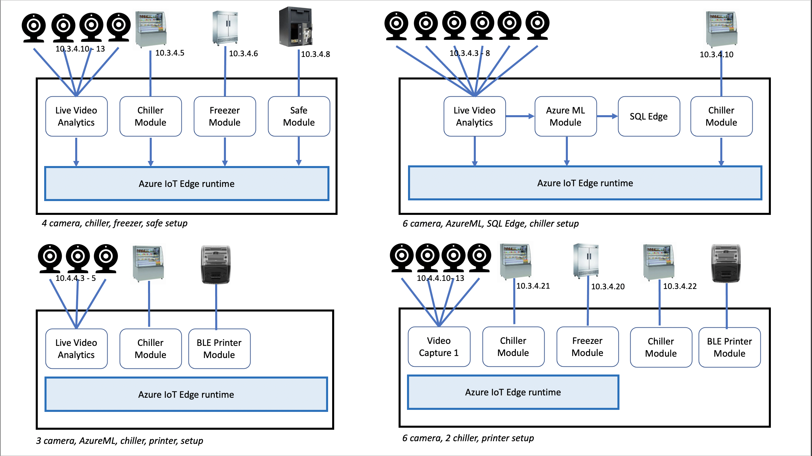
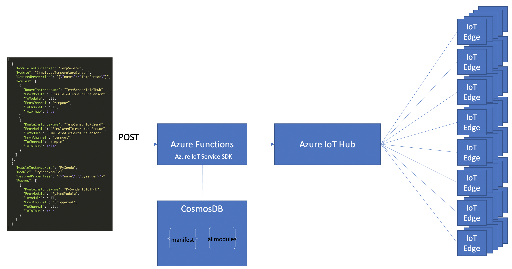

readme.md
# IoT Edge Configuration Management


This project provides an approach to configure workloads on a fleet of IoT Edge. A workload is a one or more Docker Containers running as IoT Edge Modules.

<br>

## Table of contents
* [Engage and contribute](#engage-and-contribute)
* [Solution goals](#solution-goals)
* [Solution architecture & components](#solution-architecture-&-components)
* [REST API sample](#rest-api-sample)
* [PowerApps sample](#powerapps-sample)

<br>

## Engage and contribute
* Ask questions about developing for Azure IoT Edge on [Stack Overflow](https://stackoverflow.com/questions/tagged/azure-iot-edge) using the **azure-iot-edge** tag.

* Search for [known issues](https://github.com/AzureIoTGBB/iot-edge-configuration-manager/issues) or file a [new issue](https://github.com/AzureIoTGBB/iot-edge-configuration-manager/issues/new) if you find something broken in this project.

* Learn how you can contribute to this project [here](./documentation/contributing.md).

* This project has adopted the [Microsoft Open Source Code of Conduct](https://opensource.microsoft.com/codeofconduct/).
For more information, see the [Code of Conduct FAQ](https://opensource.microsoft.com/codeofconduct/faq/) or contact [opencode@microsoft.com](mailto:opencode@microsoft.com) with any additional questions or comments.

<br>
<br>
## Solution goals

The goal of this solution is as follows:
* Ability to define and configure an IoT Edge workload using PowerApps.
* Ability to configure a fleet of IoT Edge devices using REST API.
* Ability to build configuration management like concepts for IoT Edge.
* Ability to enable Operations team to manage Azure IoT Edge workloads.

The idea for this solution stems from a customer need, where in there will be a fleet of IoT Edge deployed at various locations (retail stores/factories/oil wells, etc.). Each IoT Edge has specific workloads it runs and is specific to the location.

For example, consider a retail store with multiple IoT devices such as Chillers, Refrigerators, HVAC, Cameras, Safe and other devices. All of these devices are connected to IoT Edge. Each of thesee IoT devices might have one or more modules in IoT Edge with location specific configurations such as IP address of the device, environment variables and desired properties. 

As the number of locations increases and with the variability in number of camera per location and camera configurations (IP address, camera type, etc.),the management and deployment of the workloads will tend to get complex and does not readily fit into IoT edge [Automatic Deployment for single devices or at scale](https://docs.microsoft.com/en-us/azure/iot-edge/module-deployment-monitoring). Considering each Edge is different and has variability in configurations, a single deployment manifest will not meet the needs of all Edges. 

This solution demonstrates the ability to configure and generate heterogeneous edge workloads for needs of the kind illustrated in the following picture: 
As described in the picture above, while the 4 Edge are connected to the same IoT hub, each Edge has varying workloads and location specific information. 
<br>
In IoT Edge, a workload is defined as a group of modules i.e. Docker containers and is deployed using a [deployment manifest](https://docs.microsoft.com/en-us/azure/iot-edge/module-composition). An IoT Edge deployment manifest consists of the following elements.
* Module Definition
* Routes
* Desired Properties


<br>
<br>

#### Module Definition
The [module definition](https://docs.microsoft.com/en-us/azure/iot-edge/about-iot-edge#iot-edge-modules) describes the module characteristics such as the name and tag for module image, create options, etc. 

for example, here is a sample module definition for a custom module named "PyCaptureModule"
```json
          "pyCapture1": {
            "version": "1.0",
            "type": "docker",
            "status": "running",
            "restartPolicy": "always",
            "settings": {
              "image": "paddycontainers.azurecr.ip/pycapture:1.0.0",
              "createOptions": "{\"ExposedPorts\":{\"8080/tcp\":{}},\"HostConfig\":{\"PortBindings\":{\"8080/tcp\":[{\"HostPort\":\"8080\"}]}}}"
            }
          }
```
<br>

#### Routes

[Routes](https://docs.microsoft.com/en-us/azure/iot-edge/module-composition#declare-routes) define the communication path between the modules and upstream to IoT Hub.

for example, here is a sample route for a workload
```json
    "$edgeHub": {
      "properties.desired": {
        "schemaVersion": "1.0",
        "routes": {
            "pyCapture1ToIoThub": "FROM /messages/modules/pyCapture1/outputs/* INTO $upstream",
            "pyCapture2ToIoThub": "FROM /messages/modules/pyCapture2/outputs/* INTO $upstream",
            "pyCapture3ToIoThub": "FROM /messages/modules/pyCapture3/outputs/* INTO $upstream",
            "pyCapture4ToIoThub": "FROM /messages/modules/pyCapture4/outputs/* INTO $upstream",
            "pyCapture1ToInferenceModule": "FROM /messages/modules/pyCapture1/outputs/* INTO BrokeredEndpoint(\"/modules/inferencemodule/inputs/input1\")",
            "pyCapture2ToInferenceModule": "FROM /messages/modules/pyCapture2/outputs/* INTO BrokeredEndpoint(\"/modules/inferencemodule/inputs/input2\")",
            "pyCapture3ToInferenceModule": "FROM /messages/modules/pyCapture2/outputs/* INTO BrokeredEndpoint(\"/modules/inferencemodule/inputs/input3\")",
            "pyCapture4ToInferenceModule": "FROM /messages/modules/pyCapture2/outputs/* INTO BrokeredEndpoint(\"/modules/inferencemodule/inputs/input4\")",
            "InferenceModuleToIoThub": "FROM /messages/modules/inferencemodule/outputs/* INTO $upstream"
        },
        "storeAndForwardConfiguration": {
          "timeToLiveSecs": 7200
        }
      }
    }
```

#### Desired Properties (Module Twin)
[Desired Properties](https://docs.microsoft.com/en-us/azure/iot-edge/module-composition#define-or-update-desired-properties) define the twin properties the module will use to configure its instance. In this specific example the idea is being able to define the desired properties based on the location specific attributes for the Edge. For example, the camera IP addresses at each location are different and so when the Deployment Manifest is being generated the desired properties can be based on user specified attributes or can be sourced from a Configuration Management Database that has all the infrastructure related properties that can be applied to the module as Desired Properties.


<br>
<br>

This solution demonstrates two interfaces
* PowerApps as the GUI for Edge definition and deployment.
* REST API.


IoT Edge supports  
* [Single Device Deployment](https://docs.microsoft.com/en-us/azure/iot-edge/how-to-deploy-modules-portal?view=iotedge-2018-06)
* [Layered Deployment](https://docs.microsoft.com/en-us/azure/iot-edge/module-deployment-monitoring?view=iotedge-2018-06#layered-deployment)

<br>
The goal of this project is to demonstrate how to do Single Device Deployment, but also give an example for how it can be used for deploying a fleet of devices:

<br>

## Solution architecture & components

The architecture for this solution utilizes four main components in addition to Azure IoT Hub.

* [Azure IoT Edge](https://docs.microsoft.com/en-us/azure/iot-edge/) is utilized to orchestrate and manage modules at the edge in addition to providing capabilities for offline operation and message routing.
* [Azure Functions](https://docs.microsoft.com/en-us/azure/azure-functions/functions-overview) to generate and deploy IoT Edge deployment manifest. 
* [PowerApps](https://docs.microsoft.com/en-us/powerapps/powerapps-overview) for user experience to define edge and its workloads.
* [PowerAutomate](https://docs.microsoft.com/en-us/power-automate/getting-started) for integrating the PowerApps based on events with Azure Functions.


The sample implementation demonstrates the use of REST API and PowerApps as the interface for deployment.

## REST API Sample
 
REST API accepts a JSON document that defines the modules, desired properties and routes for each of the modules that constitutes the workload. The REST API is implemented in Azure Functions and it uses [Azure IoT Hub Service .NET SDK](https://github.com/Azure/azure-iot-sdk-csharp) to interact with Azure IoT Hub for deployment to IoT Edge. [CosmosDB](https://docs.microsoft.com/en-us/azure/cosmos-db/introduction) is used to store templates for Edge Manifest & Modules.

Please read this [document](./documentation/restapi/restapi-overview.md) for configuring and deploying the Azure Function.


## PowerApps Sample

