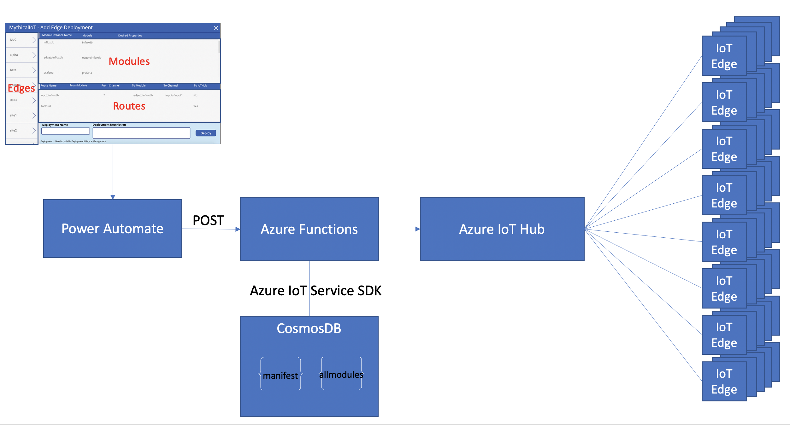

readme.md
# IoT Edge Configuration Management

This project provides an approach to configure workloads on a fleet of IoT Edge. A workload is one or more Docker containers running as IoT Edge Modules.

The goal is to provide both guidance as well as a sample implementation for deploying workloads to IoT Edge. 

<br>

## Table of contents
* [Engage and contribute](#engage-and-contribute)
* [Solution goals](#solution-goals)
* [Solution architecture and components](#solution-architecture-and-components)
* [PowerApps sample](#powerapps-sample)

<br>

## Engage and contribute
* Ask questions about developing for Azure IoT Edge on [Stack Overflow](https://stackoverflow.com/questions/tagged/azure-iot-edge) using the **azure-iot-edge** tag.

* Search for [known issues](https://github.com/AzureIoTGBB/iot-edge-configuration-manager/issues) or file a [new issue](https://github.com/AzureIoTGBB/iot-edge-configuration-manager/issues/new) if you find something broken in this project.

* Learn how you can contribute to this project [here](./documentation/contributing.md).

* This project has adopted the [Microsoft Open Source Code of Conduct](https://opensource.microsoft.com/codeofconduct/).
For more information, see the [Code of Conduct FAQ](https://opensource.microsoft.com/codeofconduct/faq/) or contact [opencode@microsoft.com](mailto:opencode@microsoft.com) with any additional questions or comments.

<br>
<br>

## Solution goals

The idea for this solution stems from a customer need to deploy varying workloads to a fleet of IoT Edge at various locations (retail stores/factories/oil wells/etc.). Each IoT Edge runs workloads specific to the location.

For example, consider a retail store with multiple IoT devices such as Chillers, Refrigerators, HVAC, Cameras, Safe and other devices connected to IoT Edge. Each of these IoT devices has one or more modules in IoT Edge with location specific configurations such as IP address of the device, environment variables and desired properties. 

As the number of locations increases and the variability in number of devices per location, such as number of camera, configuration for each camera (IP address, camera type, etc.), the management and deployment of the workloads will tend to get complex and does not readily fit into IoT edge [Automatic Deployment for single devices or at scale](https://docs.microsoft.com/en-us/azure/iot-edge/module-deployment-monitoring). Considering each IoT Edge is different and has variability in configurations by workload, a single deployment manifest for the entire fleet will not meet the needs of all Edges. 

This solution demonstrates the ability to configure heterogeneous edge workloads for needs of the kind illustrated in the following picture: 
As described in the picture above, while each of the four IoT Edge is connected to the same IoT hub, each Edge has varying workloads and location specific information. 

This solution uses a configuration store to apply the appropriate location specific configuration and generates an IoT Edge manifest for each of the workload and keep it specific to the location.
<br>
<br>
<br>

## Solution architecture and components

 
The solution is implemented as a REST API in Azure Functions, and accepts a JSON document that defines the modules, desired properties and routes [MDR] for each of the modules that constitutes the workload. The REST API uses [Azure IoT Hub Service .NET SDK](https://github.com/Azure/azure-iot-sdk-csharp) to interact with Azure IoT Hub for deployment to IoT Edge. [CosmosDB](https://docs.microsoft.com/en-us/azure/cosmos-db/introduction) is used as the data store for Edge Manifest & Module definition.

The REST API is the backend interface that can be fronted with any type of UX. In this repo we have a sample PowerApps App as the UX interface to define modules, desired properties and Routes [MDR].
 

## Solution architecture

The solution consists of the following components:

1. CosmosDB Database as the configuraton store
2. Azure Functions for hosting REST API
3. PowerApps as a sample UX

## Understanding the Solution
At the core, an IoT Edge workload is represented as an IoT Edge manifest. The Manifest includes the following sections
1. Modules
2. Desired Properties
3. Routes

This solution assembles the sections to generate an IoT Edge Manifest specific to the workload and deploy it to IoT Edge.

Here is an example walk-thru of a solution.

Scenario:
Consider a retail location with 
1. A chiller accessible over IP @ 10.3.4.5
2. A freezer accessible over IP @ 10.3.4.6
3. A temp analyzer that reacts to temp readings from Chiller, Freezer


The workload comprises of the following 3 IoT Edge Modules (docker containers) namely:
1. Chiller (acrcontainers.azurecr.io/chiller:v1)
2. Freezer (acrcontainers.azurecr.io/freezer:v2)
3. Temp Analyzer (acrcontainers.azurecr.io/tempanalyzer:v1)

Each of these Modules has a set of Desired Properties and Routes that define the workload configuration on IoTEdge.

The input to REST API to generate IoT Edge manifest for this workload is as follows:

```json
[
  {
    "ModuleInstanceName": "BackroomChiller",
    "Module": "chiller",
    "DesiredProperties": "{\"endPoint\": \"10.3.4.5\",\"armEndpoint\": \"https://chiller.azurewebsites.net/\",\"diagnosticsEventsOutputName\": \"chillerDiagnostics\",\"operationalEventsOutputName\": \"chillerOperational\",\"logLevel\": \"Information\",\"logCategories\": \"Application,Events\",\"telemetryOptOut\": false}",
    "Routes": [
      {
        "RouteInstanceName": "BackroomChillerToTempAnalyzer",
        "FromModule": "BackroomChiller",
        "FromChannel": "tempreadings",
        "ToModule": "TempAnalyzer",
        "ToChannel": "chillertemp",
        "ToIoThub": false
      },
      {
        "RouteInstanceName": "BackroomChillerToIoTHub",
        "FromModule": "BackroomChiller",
        "FromChannel": "tempdiagnostics",
        "ToModule": "",
        "ToChannel": "",
        "ToIoThub": true
      }
    ]
  },
  {
    "ModuleInstanceName": "frontfreezer",
    "Module": "freezer",
    "DesiredProperties": "{\"endPoint\":\"10.3.4.6\"}",
    "Routes": [
      {
        "RouteInstanceName": "frontfreezerToTempAnalyzer",
        "FromModule": "frontfreezer",
        "FromChannel": "tempreadings",
        "ToModule": "TempAnalyzer",
        "ToChannel": "freezertemp",
        "ToIoThub": false
      }
    ]
  },
  {
    "ModuleInstanceName": "tempAnalyzer",
    "Module": "tempAnalyzer",
    "DesiredProperties": "{\"chillerThreshold\":\"43\", \"freezerThreshold\":\"32\"}",
    "Routes": [
      {
        "RouteInstanceName": "tempAnalyzerToIoTHub",
        "FromModule": "tempanalyzer",
        "FromChannel": "*",
        "ToModule": "",
        "ToChannel": "",
        "ToIoThub": true
      }
    ]
  }
]
```

As you can see in this workload definition, there is workload specific configuration applied as desired properties. Imagine having a core configuration management database across the organization that houses all the location specific information that can be applied at the time of IoT Edge manifest generation, thereby supporting the need for location specific configurations for IoT Edge workloads.


## PowerApps sample
As an example in this repository we have put together a sample PowerApp that assists the operator in assembling the workload and deploying it to IoTedge. In this case a PowerApps collects the configuration and integrates using PowerAutomate with the REST api to deploy the workload.

 


## Deploying the Solution
The solution is deployed in 2 parts
1. REST API - An installation bash script [setup.sh](./Install/setup.sh) creates all the resources required for depeloying Azure services frequired for the solution. The Azure resources created include
    - Resource Group
    - Function App 
    - CosmosDB Account, Database and Containers

The install script expects a local file with the name "install.settings.json". This file contains the various input values to create the Azure resources. Please update this file with appropriate values prior to executing the script.
  ```
  {
    "RESOURCE_GROUP":"<NAME OF RESOURCE GROUP>",
    "FUNCTIONAPP_NAME":"<NAME OF FUNCTION APP>",
    "FUNCTIONAPP_STORAGE_ACCOUNT_NAME":"<NAME OF STORAGE ACCT FOR FUNCTION APP>",
    "LOCATION":"<LOCATION>",
    "APPINSIGHTS_NAME":"<NAME OF APPINSIGHT FOR FUNCTIONAPP",
    "IOTHUB_NAME":"<NAME OF IOT HUB>",
    "IOTHUB_CONN_STRING_CSHARP":"<IOTHUBOWNER CONNECTION STRING>",
    "ACR":"<NAME OF AZURE CONTAINER REGISTRY>",
    "ACRUSER":"<AZURE CONTAINER REGISTRY USER NAME>",
    "ACRPASSWORD":"<AZURE CONTAINER REGISTRY USER PASSWORD>",
    "COSMOSACCOUNTNAME":"<NAME OF COSMOS ACCOUNT>",
    "COSMOSDBNAME":"<NAME COSMOS DATABASE>",
    "COSMOSCONTAINER_ALLMODULES":"allmodules",
    "COSMOSCONTAINER_MANIFEST":"manifest"
}
  ```
The install script can be eexecuted from Azure Cloud Shell or from any BASH shell. The installation script requires the following files
* setup.sh
* install.settings.json (the inputs)
* idxpolicy.json (cosmosdb index policy)
* manifest.json (IoT Edge manifest template)
* SimulatedTempSensor.json (Sample IoTEdge Module definition)


2. PowerApp solution installation - Steps to [install](./Install/PowerAppInstallationSteps.pptx)
    - [PowerApp Install Solution Package](./Install/PowerTools4IoTEdge_1_0_0_7.zip) 
    - Import [PowerApp Canvas App](./Install/PowerAppOperator4IoTEdge_1_0_0_7.zip)


## Using the PowerApp 
After successful deployment of Azure Function (IoTEdgeCTL), PowerAppOperator4IoTEdge and PowerAutomate2IoTEdgeCTL, its time to use the PowerApp.

In the PowerApp, we need to setup the following item
a. Edge
b. Modules
c. Edge Modules
d. Edge Routes

### Edge Definition
In PowerApp